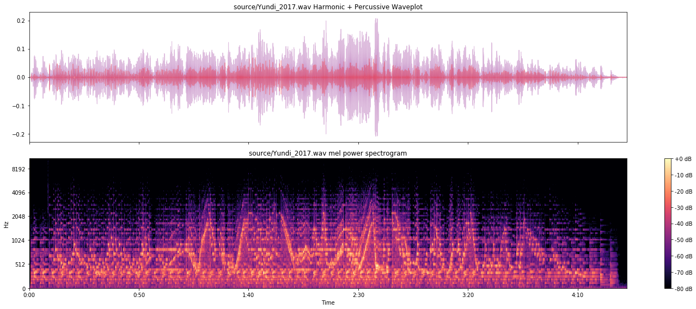
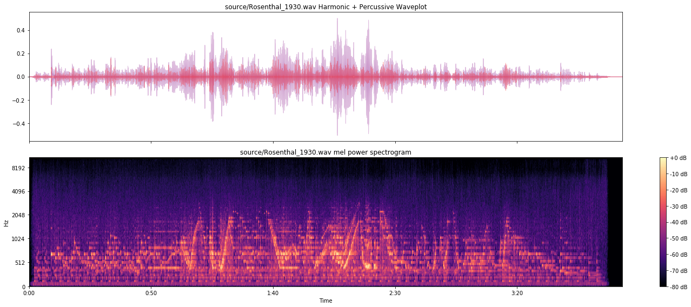
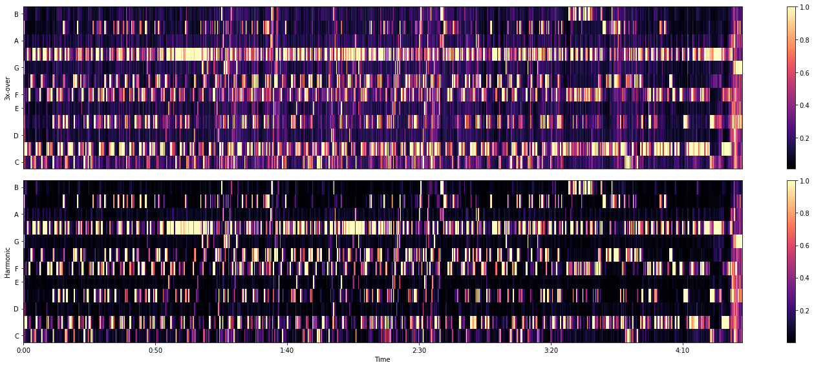
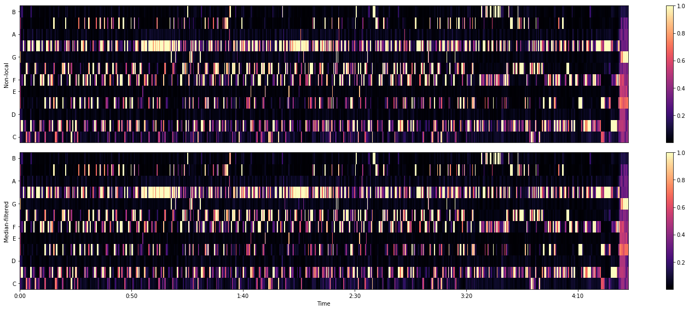
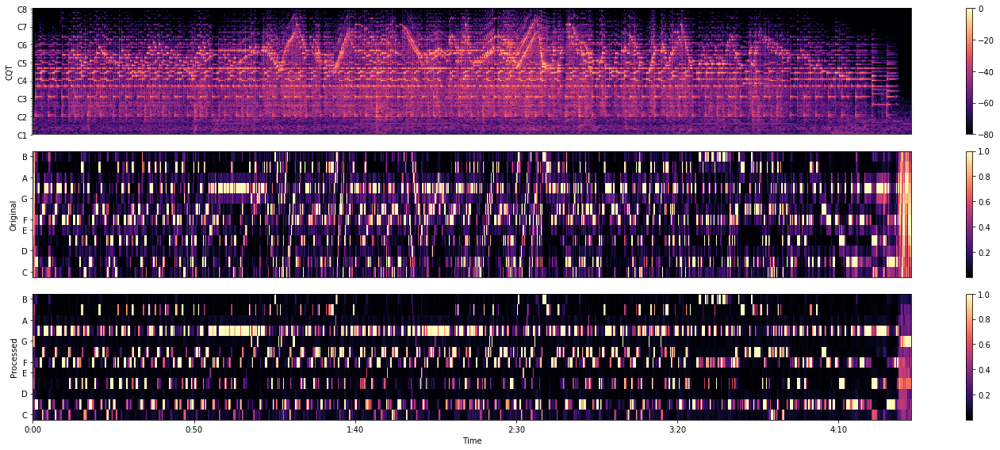

# VACUUM - (Yundi_2017.wav, Rosenthal_1930.wav) 

VISUAL AUDIO COMPARISION UTILITY [FOR] UNDERSTANDING [AND] MEASUREMENT

A testing and analysis workflow

<h1>Table of Contents</h1>

<ul class="toc-item"><li><a href="#VACUUM" data-toc-modified-id="VACUUM-1">1&nbsp;&nbsp;VACUUM</a></li><li><a href="#Imports" data-toc-modified-id="Imports-2">2&nbsp;&nbsp;Imports</a><ul class="toc-item"><li><a href="#Librosa" data-toc-modified-id="Librosa-2.1">2.1&nbsp;&nbsp;Librosa</a></li><li><a href="#IPython" data-toc-modified-id="IPython-2.2">2.2&nbsp;&nbsp;IPython</a></li><li><a href="#Numpy" data-toc-modified-id="Numpy-2.3">2.3&nbsp;&nbsp;Numpy</a></li><li><a href="#Scipy" data-toc-modified-id="Scipy-2.4">2.4&nbsp;&nbsp;Scipy</a></li><li><a href="#Matplotlib" data-toc-modified-id="Matplotlib-2.5">2.5&nbsp;&nbsp;Matplotlib</a></li></ul></li><li><a href="#Let's-bring-the-files-in" data-toc-modified-id="Let's-bring-the-files-in-3">3&nbsp;&nbsp;Let's bring the files in</a><ul class="toc-item"><li><a href="#Source1-Track-(-&lt;span id='python_0cb2894e7ad54b1ba8156b1ddefd8c1c_136'&gt;&lt;/span&gt;-)" data-toc-modified-id="Source1-Track-(--)-3.1">3.1&nbsp;&nbsp;Source1 Track (  )</a><ul class="toc-item"><li><a href="#Open-Source1,-get-some-basic-statistics-and-create-a-player" data-toc-modified-id="Open-Source1,-get-some-basic-statistics-and-create-a-player-3.1.1">3.1.1&nbsp;&nbsp;Open Source1, get some basic statistics and create a player</a></li><li><a href="#Let's-take-a-first-look-at-the-file" data-toc-modified-id="Let's-take-a-first-look-at-the-file-3.1.2">3.1.2&nbsp;&nbsp;Let's take a first look at the file</a></li></ul></li><li><a href="#Source-2-Track--(-&lt;span id='python_20ea2a881a80453bb86ba76c5fbd1f6e_142'&gt;&lt;/span&gt;-)" data-toc-modified-id="Source-2-Track--(--)-3.2">3.2&nbsp;&nbsp;Source 2 Track  (  )</a><ul class="toc-item"><li><a href="#Open-Source2,-get-some-basic-statistics-and-create-a-player" data-toc-modified-id="Open-Source2,-get-some-basic-statistics-and-create-a-player-3.2.1">3.2.1&nbsp;&nbsp;Open Source2, get some basic statistics and create a player</a></li><li><a href="#Let's-take-a-first-look-at-the-file" data-toc-modified-id="Let's-take-a-first-look-at-the-file-3.2.2">3.2.2&nbsp;&nbsp;Let's take a first look at the file</a></li></ul></li></ul></li><li><a href="#Enhanced-chroma-and-chroma-variants-(source1)" data-toc-modified-id="Enhanced-chroma-and-chroma-variants-(source1)-4">4&nbsp;&nbsp;Enhanced chroma and chroma variants (source1)</a><ul class="toc-item"><li><a href="#Original-source1" data-toc-modified-id="Original-source1-4.1">4.1&nbsp;&nbsp;Original source1</a></li><li><a href="#Correct-Tuning-Deviations" data-toc-modified-id="Correct-Tuning-Deviations-4.2">4.2&nbsp;&nbsp;Correct Tuning Deviations</a></li><li><a href="#Isolate-harmonic-component" data-toc-modified-id="Isolate-harmonic-component-4.3">4.3&nbsp;&nbsp;Isolate harmonic component</a></li><li><a href="#Non-local-filtering" data-toc-modified-id="Non-local-filtering-4.4">4.4&nbsp;&nbsp;Non-local filtering</a></li><li><a href="#Horizontal-Median-Filter" data-toc-modified-id="Horizontal-Median-Filter-4.5">4.5&nbsp;&nbsp;Horizontal Median Filter</a></li><li><a href="#Before-and-After" data-toc-modified-id="Before-and-After-4.6">4.6&nbsp;&nbsp;Before and After</a></li></ul></li><li><a href="#Applying-chroma-enchancement-techniques-to-source-files" data-toc-modified-id="Applying-chroma-enchancement-techniques-to-source-files-5">5&nbsp;&nbsp;Applying chroma enchancement techniques to source files</a><ul class="toc-item"><li><a href="#Source1" data-toc-modified-id="Source1-5.1">5.1&nbsp;&nbsp;Source1</a></li><li><a href="#Source2" data-toc-modified-id="Source2-5.2">5.2&nbsp;&nbsp;Source2</a></li></ul></li><li><a href="#Output-comparisions-for-testing" data-toc-modified-id="Output-comparisions-for-testing-6">6&nbsp;&nbsp;Output comparisions for testing</a></li><li><a href="#Run-imageDiff" data-toc-modified-id="Run-imageDiff-7">7&nbsp;&nbsp;Run imageDiff</a></li></ul>

# Imports 

	Librosa
	IPython
	Numpy
	Scipy
	Matplotlib

# Let's bring the files in

## Source1 Track ( source/Yundi_2017.wav )

### Open Source1, get some basic statistics and create a player

    File: source/Yundi_2017.wav 
    Duration: 272.4534 sec
    Tuning estimate: 0.08999999999999997

### Let's take a first look at the file

## Source 2 Track  ( source/Rosenthal_1930.wav )

### Open Source2, get some basic statistics and create a player

    File: source/Rosenthal_1930.wav 
    Duration: 243.1334 sec
    Tuning estimate: 0.19000000000000006

### Let's take a first look at the file

# Enhanced chroma and chroma variants (source1)
[Enhanced chroma and chroma variants](http://librosa.github.io/librosa/auto_examples/plot_chroma.html#sphx-glr-auto-examples-plot-chroma-py)

## Original source1

## Correct Tuning Deviations

## Isolate harmonic component

## Non-local filtering

## Horizontal Median Filter

## Before and After

# Applying chroma enchancement techniques to source files

## Source1

## Source2

# Output comparisions for testing

# Run imageDiff

    SSIM: 0.2895809881272474

